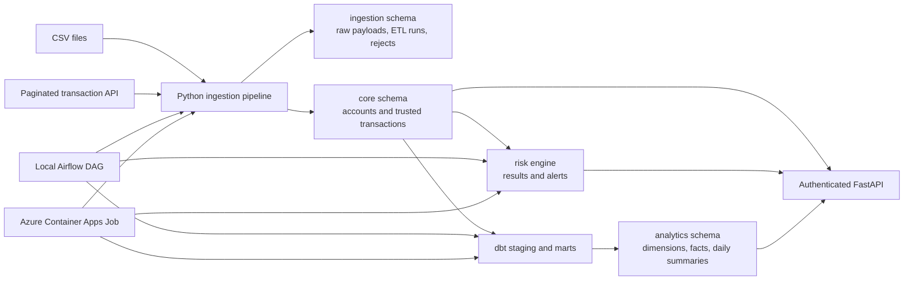
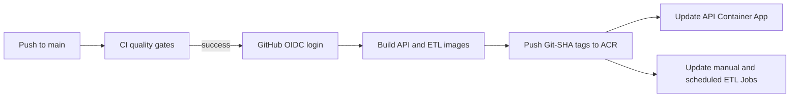

# Banking Transaction Intelligence Platform

A production-oriented data and API platform that ingests banking transactions,
separates accepted and rejected records, evaluates transaction risk, builds
analytical models, and exposes trusted data through an authenticated API.

The project is designed as a realistic portfolio system for junior-to-intermediate
Data Engineer and Software Engineer roles. It demonstrates the full path from raw
data ingestion to operational analytics, including PostgreSQL data modelling,
idempotent ETL, dbt transformations, risk workflows, FastAPI services, Airflow
orchestration, automated testing, containerisation, CI/CD, and Azure deployment.

## System architecture



### End-to-end data flow

1. Transactions are extracted from a CSV file or a paginated HTTP API.
2. Pandas-based transformations normalise fields and validate business rules.
3. Valid and invalid records are separated instead of silently discarding bad data.
4. Raw payloads are retained in PostgreSQL `JSONB` for traceability.
5. Deterministic record fingerprints make repeated ingestion idempotent.
6. Trusted accounts and transactions are loaded into the `core` schema.
7. A high-amount rule evaluates transactions in keyset-paginated batches.
8. Risk results and investigation alerts are written idempotently.
9. dbt builds tested dimensions, facts, and daily transaction summaries.
10. FastAPI exposes operational, analytical, and risk data to authenticated clients.

## Key engineering capabilities

### Data ingestion and ETL

- CSV and paginated API extraction
- retry-enabled HTTP sessions, timeouts, and optional Bearer authentication
- cleaning, type conversion, validation, and accepted/rejected routing
- raw `JSONB` payload retention and rejection-reason storage
- record fingerprints and database constraints for idempotent processing
- batch inserts and ETL run status/count tracking
- command-line workflows for repeatable operations

### Data warehouse

- dbt Core with `dbt-postgres`
- staging models for accounts and transactions
- `dim_accounts` and `fct_transactions`
- `mart_daily_transaction_summary`
- schema, uniqueness, not-null, relationship, and custom SQL tests
- 54 successful models/tests in the validated warehouse build

### Risk intelligence

- configurable high-amount transaction rule
- keyset pagination for bounded batch processing
- idempotent transaction risk results
- automatic risk-alert creation
- investigation lifecycle: `open -> investigating -> resolved/dismissed`
- guarded state transitions that reject invalid workflow changes

### API and observability

- FastAPI with Pydantic response models
- API-key authentication through the `X-API-Key` header
- pagination and filtering for transactions, analytics, and risk alerts
- separate liveness and database-readiness endpoints
- structured JSON application logs
- `X-Request-ID` correlation across requests and logs

### Delivery and operations

- reproducible Python environments with `uv` and `uv.lock`
- PostgreSQL and service orchestration with Docker Compose
- Alembic database migrations
- non-root API and ETL Docker images
- local Airflow orchestration demonstration
- Azure Container Apps for the public API
- Azure Container Apps Jobs for manual and scheduled ETL
- GitHub Actions CI and passwordless Azure CD using OIDC

## Technology stack

| Area | Technology |
|---|---|
| Language | Python 3.13 |
| Dependency management | uv |
| API | FastAPI, Uvicorn, Pydantic |
| Data processing | pandas, requests |
| Database | PostgreSQL 18, SQLAlchemy, psycopg |
| Migrations | Alembic |
| Warehouse | dbt Core, dbt-postgres |
| Orchestration | Apache Airflow, Azure Container Apps Jobs |
| Testing and quality | pytest, Ruff, dbt tests |
| Containers | Docker, Docker Compose |
| Cloud | Azure Container Apps, Azure PostgreSQL Flexible Server, ACR |
| Automation | GitHub Actions CI/CD, Azure OIDC federation |

## Implementation map

This table connects each platform capability to the technology and engineering
approach used to implement it.

| Platform capability | Main technology | Implementation in this project |
|---|---|---|
| CSV extraction | pandas, `pathlib` | reads transaction files into DataFrames while preserving the source filename and ingestion context |
| API extraction | requests | retrieves paginated transaction data with retry-enabled sessions, timeouts, page sizing, and optional Bearer authentication |
| Cleaning and transformation | pandas, Python | normalises column names, parses dates and amounts, standardises values, and prepares database-ready records |
| Data validation | Python validators, pandas | applies required-field, type, format, and business-rule checks before loading trusted data |
| Accepted/rejected routing | Python pipeline services | sends valid records to trusted tables and invalid records to `rejected_records` with rejection reasons |
| Raw-data retention | PostgreSQL `JSONB` | stores original source payloads in `raw_transactions` for lineage, debugging, and replay |
| Idempotent ingestion | SHA fingerprints, PostgreSQL constraints | generates deterministic record fingerprints and uses conflict-safe writes to prevent duplicate trusted transactions |
| ETL observability | PostgreSQL, SQLAlchemy | records run status, accepted/rejected counts, timestamps, and failure information in `etl_runs` |
| Operational data model | PostgreSQL, SQLAlchemy ORM | represents source systems, accounts, transactions, ETL runs, risk rules, results, and alerts as application models |
| Schema versioning | Alembic | applies ordered, repeatable database migrations across local, CI, and Azure environments |
| Risk evaluation | Python rule evaluator, SQLAlchemy Core | evaluates the configurable high-amount rule in bounded keyset-paginated batches |
| Idempotent risk results | PostgreSQL constraints, transactional writes | prevents repeated evaluation from duplicating transaction risk results or alerts |
| Alert investigation | FastAPI, service-layer commands | enforces valid `open`, `investigating`, `resolved`, and `dismissed` state transitions |
| Warehouse staging | dbt Core, dbt-postgres | converts operational `core` tables into clean staging models for downstream analytics |
| Dimensional analytics | dbt SQL models | builds `dim_accounts`, `fct_transactions`, and the daily transaction summary mart |
| Warehouse data quality | dbt tests | validates not-null, uniqueness, relationships, accepted values, and custom business assertions |
| Transaction API | FastAPI, Pydantic, SQLAlchemy | returns validated, paginated transaction responses through a service-layer query |
| Analytics API | FastAPI, dbt marts | serves date- and currency-filtered daily metrics from warehouse models |
| Risk API | FastAPI, Pydantic | exposes filtered risk alerts and controlled investigation updates |
| API authentication | FastAPI dependency injection | validates the `X-API-Key` header before protected routes execute |
| Liveness and readiness | FastAPI, SQLAlchemy | separates process health (`/health`) from live PostgreSQL connectivity (`/ready`) |
| Structured logging | Python logging, custom middleware | emits JSON logs containing method, path, status, duration, and request correlation data |
| Request correlation | `X-Request-ID` middleware | accepts or generates a request ID and returns it to clients for cross-log tracing |
| Local orchestration | Apache Airflow | schedules ingestion, risk evaluation, and dbt build as ordered tasks with retries and no catch-up |
| Cloud ETL execution | Azure Container Apps Jobs | runs the packaged bootstrap, ingestion, risk, and dbt workflow as a lightweight cloud batch job |
| Cloud scheduling | Container Apps scheduled Job | starts the ETL image daily from a UTC cron expression without hosting Airflow in Azure |
| API containerisation | Docker, Uvicorn | packages FastAPI and Alembic in a reproducible non-root Python 3.13 image |
| ETL containerisation | Docker, uv dependency groups | packages the application, dbt runtime, warehouse project, and deterministic demo CSV in a separate non-root image |
| Local infrastructure | Docker Compose | coordinates PostgreSQL, migrations, API, Airflow database, scheduler, API server, and DAG processor |
| Continuous integration | GitHub Actions | runs Ruff, migrations, dbt, pytest, Compose validation, Docker build, and an image smoke test against PostgreSQL |
| Container registry | Azure Container Registry | stores separate API and ETL repositories using immutable short Git-SHA tags |
| Passwordless cloud delivery | GitHub OIDC, Microsoft Entra ID | exchanges GitHub's signed short-lived OIDC token for Azure access without storing a client secret |
| Automated deployment | GitHub Actions, Azure CLI | deploys only a CI-tested revision and updates the API plus both ETL Job image references |
| Cloud API hosting | Azure Container Apps | provides managed ingress, revisions, logs, health checks, and scale-to-zero behaviour |
| Cloud database | Azure PostgreSQL Flexible Server | hosts the migrated operational and analytical schemas used by the API and ETL Jobs |
| Image rollback | ACR Git-SHA tags, Azure CLI | restores a previously validated API or ETL image without rebuilding historical source code |

## PostgreSQL data model

The platform separates operational responsibilities into four schemas:

| Schema | Purpose | Main objects |
|---|---|---|
| `ingestion` | lineage, raw data, and data-quality failures | `source_systems`, `etl_runs`, `raw_transactions`, `rejected_records` |
| `core` | validated operational entities | `accounts`, `transactions` |
| `risk` | risk configuration and investigation workflow | `risk_rules`, `transaction_risk_results`, `risk_alerts` |
| `analytics` | dbt-managed reporting models | `dim_accounts`, `fct_transactions`, `mart_daily_transaction_summary` |

See [Data Model](docs/data-model.md) for the detailed table catalogue and data
flow.

## Repository structure

```text
.
|-- .github/workflows/        # CI and Azure CD workflows
|-- data/samples/             # deterministic demo transaction data
|-- docs/                     # data model and cloud deployment documentation
|-- migrations/               # Alembic migration environment and revisions
|-- orchestration/airflow/    # Airflow image and daily DAG
|-- src/banking_intelligence/
|   |-- api/                  # FastAPI routes, schemas, auth, middleware
|   |-- bootstrap/            # idempotent demo configuration
|   |-- database/             # SQLAlchemy engine and ORM models
|   |-- demo_data/            # deterministic data generation
|   |-- ingestion/            # extract, transform, validate, and load
|   |-- jobs/                 # deployable end-to-end ETL job
|   |-- risk/                 # rule evaluation and alert workflows
|   `-- services/             # API query and command services
|-- tests/                    # unit, integration, and API tests
|-- warehouse/                # dbt project, models, and tests
|-- compose.yaml              # PostgreSQL, API, migrations, and Airflow
|-- Dockerfile                # FastAPI runtime image
`-- Dockerfile.etl            # dbt-enabled ETL Job image
```

## Local quick start

### Prerequisites

- Docker Desktop with Docker Compose
- Python 3.13
- [uv](https://docs.astral.sh/uv/)

### 1. Configure the environment

Copy the example environment file and replace all placeholder values:

```powershell
Copy-Item .env.example .env
```

Never commit `.env` or real credentials.

### 2. Install dependencies

```powershell
uv sync --locked --dev --group etl
```

The dedicated `etl` dependency group includes dbt without adding development
tools to the production ETL image.

### 3. Start PostgreSQL and apply migrations

```powershell
docker compose up -d db
uv run alembic upgrade head
```

Alternatively, let Docker Compose build the API image and run migrations before
starting the service:

```powershell
docker compose up --build db migrate api
```

### 4. Bootstrap and run the demo pipeline

```powershell
uv run banking-intelligence bootstrap-demo-config

uv run banking-intelligence ingest-csv `
  --source-name demo-csv `
  data/samples/demo_transactions.csv

uv run banking-intelligence evaluate-risk `
  --rule-id 1 `
  --batch-size 1000

uv run dbt build `
  --project-dir warehouse `
  --profiles-dir warehouse
```

`bootstrap-demo-config` prints the database-generated source-system and risk-rule
IDs. Use the returned rule ID instead of assuming it is always `1` in a reused
database.

### 5. Run the API locally

```powershell
uv run uvicorn banking_intelligence.api.app:app --reload
```

Useful local URLs:

- API documentation: `http://localhost:8000/docs`
- liveness: `http://localhost:8000/health`
- readiness: `http://localhost:8000/ready`

## Command-line workflows

```text
banking-intelligence bootstrap-demo-config
banking-intelligence ingest-csv --source-name NAME FILE_PATH
banking-intelligence ingest-api --source-name NAME [--page-size 100]
banking-intelligence evaluate-risk --rule-id ID [--batch-size 1000]
banking-intelligence-demo-job
```

The deployable demo Job runs four fail-fast stages in order:

```text
bootstrap configuration -> ingest CSV -> evaluate risk -> dbt build
```

## API endpoints

| Method | Endpoint | Authentication | Purpose |
|---|---|---|---|
| `GET` | `/health` | Public | API process liveness |
| `GET` | `/ready` | Public | PostgreSQL connectivity/readiness |
| `GET` | `/transactions` | `X-API-Key` | paginated trusted transactions |
| `GET` | `/analytics/daily-summary` | `X-API-Key` | filtered daily transaction metrics |
| `GET` | `/risk/alerts` | `X-API-Key` | filtered investigation queue |
| `PATCH` | `/risk/alerts/{alert_id}` | `X-API-Key` | controlled alert-state transition |

Example authenticated requests:

```powershell
$headers = @{ "X-API-Key" = $env:PLATFORM_API_KEY }

Invoke-RestMethod `
  -Uri "http://localhost:8000/transactions?limit=10&offset=0" `
  -Headers $headers

Invoke-RestMethod `
  -Uri "http://localhost:8000/analytics/daily-summary?currency_code=NZD" `
  -Headers $headers
```

## Airflow orchestration

The local `banking_intelligence_daily` DAG runs at 02:00 in the
`Pacific/Auckland` timezone and enforces this dependency order:

```text
ingest CSV -> evaluate transaction risk -> dbt build
```

It uses Airflow's `LocalExecutor`, retries failed tasks twice, disables catch-up,
and limits the DAG to one active run.

Start the complete local stack with:

```powershell
docker compose up --build
```

The Airflow UI/API server is available at `http://localhost:8080` by default.

## Testing and quality gates

Run the local quality checks with:

```powershell
uv run ruff check .
uv run ruff format . --check
uv run pytest
uv run dbt build --project-dir warehouse --profiles-dir warehouse
docker compose config --quiet
```

GitHub Actions CI runs the same critical checks against a real PostgreSQL service:

1. install the locked Python and ETL dependencies;
2. run Ruff lint and formatting checks;
3. apply all Alembic migrations;
4. build and test the dbt warehouse;
5. run the pytest suite;
6. validate Docker Compose;
7. build and smoke-test the API image.

## Azure deployment

The deployed development environment uses a hybrid architecture:

- **Azure PostgreSQL Flexible Server** stores operational and analytical data.
- **Azure Container Registry** stores Git-SHA-tagged API and ETL images.
- **Azure Container Apps** hosts the public FastAPI service.
- **Azure Container Apps Job** provides an on-demand ETL/backfill path.
- **Azure Container Apps scheduled Job** runs the ETL workflow daily at
  `0 14 * * *` UTC.
- **Log Analytics** retains API and completed Job logs.
- **Microsoft Entra workload identity federation** allows GitHub Actions to
  deploy without an Azure client secret.

Public API base URL:

```text
https://ca-banking-intelligence-api-dev.nicebeach-b97e3acc.newzealandnorth.azurecontainerapps.io
```

The environment may be scaled down or removed when the portfolio demonstration
is not in use. Authenticated endpoints always require a valid API key.

Detailed deployment decisions and validation evidence are recorded in
[Azure Cloud Deployment](docs/azure-cloud-deployment.md).

## CI/CD flow



The CD workflow deploys only the exact revision that passed CI. The successful
reference deployment used tag `337d865`; every CD run derives its own short Git
SHA rather than reusing `latest`.

The workflow updates Job images but does not automatically start the manual Job
or recreate the scheduled trigger. Runtime configuration and scheduling remain
separate from application-image deployment.

## Rollback strategy

Rollback uses a previously validated immutable image tag. It does not rebuild
old source code.

```powershell
$previousTag = "<previous-git-sha>"
$registry = "bankingintelligencenzdev.azurecr.io"
$resourceGroup = "rg-banking-intelligence-dev"

az containerapp update `
  --name ca-banking-intelligence-api-dev `
  --resource-group $resourceGroup `
  --image "$registry/banking-intelligence-api:$previousTag"

az containerapp job update `
  --name job-banking-etl-dev `
  --resource-group $resourceGroup `
  --image "$registry/banking-intelligence-etl:$previousTag"

az containerapp job update `
  --name job-banking-etl-scheduled-dev `
  --resource-group $resourceGroup `
  --image "$registry/banking-intelligence-etl:$previousTag"
```

After rollback, verify `/health`, `/ready`, an authenticated transaction query,
the active Container App revision, and both Job image references. Database
migrations require a separate compatibility assessment because reverting an image
does not automatically reverse schema changes.

## Security decisions

- credentials are loaded from environment variables and secret references;
- `.env` is excluded from version control;
- authenticated APIs use `X-API-Key`;
- Azure CD uses short-lived OIDC tokens instead of a client secret;
- ACR access uses scoped RBAC roles and managed identities;
- API and ETL containers run as a non-root user;
- database readiness is checked without exposing connection details;
- structured logs avoid intentionally recording passwords or API keys.

The Azure PostgreSQL administrator-password rotation is tracked as a deliberately
deferred development-environment security task. It must be completed before the
environment is treated as production-like.

## Important design decisions

### Preserve raw and rejected data

Invalid records are not discarded. Raw payloads and rejection reasons provide
lineage, support debugging, and allow future replay after validation rules change.

### Make every processing stage idempotent

Fingerprints, upserts, uniqueness constraints, and conflict-safe writes allow the
same input to be processed repeatedly without duplicating trusted transactions,
risk results, or alerts.

### Separate operational and analytical models

SQLAlchemy manages application-facing tables, while dbt owns reporting models.
This keeps transactional write concerns separate from analytical transformation
and testing.

### Keep Airflow local in the portfolio environment

Airflow demonstrates DAG authoring, task dependencies, scheduling, and retries,
but hosting the complete stack in Azure would add unnecessary cost and operational
overhead. Lightweight Container Apps Jobs provide the cloud execution path.

### Use immutable image versions

Git SHA tags connect source code, CI results, registry images, deployed revisions,
and rollback targets. This is more auditable than deploying a mutable `latest` tag.

## Current status

- local Python, PostgreSQL, dbt, FastAPI, risk, Airflow, Docker, and CI workflows
  are implemented and tested;
- the public FastAPI service is deployed and health/readiness verified;
- the cloud ETL Job has completed successfully and demonstrated repeated-run
  idempotency;
- the scheduled cloud ETL Job is configured;
- GitHub Actions CI/CD has completed an end-to-end Azure deployment successfully;
- remaining portfolio work is final acceptance, interview preparation, and
  eventual cloud-resource cleanup.

## Interview discussion guide

When presenting this project, explain it in this order:

1. **Problem:** raw transaction feeds are unreliable and need traceable validation,
   risk evaluation, and usable analytics.
2. **Pipeline:** ingest CSV/API data, separate rejects, load trusted core entities,
   evaluate risk, and build dbt marts.
3. **Reliability:** fingerprints and database constraints make repeated processing
   safe; ETL runs and raw payloads make failures observable.
4. **Serving:** FastAPI exposes trusted transactions, analytical summaries, and an
   alert-investigation workflow with authentication and pagination.
5. **Operations:** Airflow demonstrates local orchestration, while Azure Jobs run
   the lightweight cloud ETL path.
6. **Delivery:** CI validates code, migrations, dbt, tests, Compose, and the image;
   CD uses OIDC and Git-SHA tags to deploy only a tested revision.
7. **Trade-off:** this is a cost-controlled portfolio architecture, not a claim that
   API-key authentication, public database networking, or a single development
   environment is sufficient for a real bank.

## Production improvements

For a real regulated banking environment, the next improvements would include:

- private networking and private endpoints;
- Azure Key Vault references and formal secret rotation;
- OAuth2/OIDC user and service authentication with granular authorisation;
- infrastructure as code with Bicep or Terraform;
- multiple isolated environments and deployment approvals;
- schema-contract/version management for upstream sources;
- dead-letter replay tooling and operational alerting;
- backup/restore exercises and disaster-recovery objectives;
- data encryption/governance controls and auditable access policies;
- broader risk rules or a versioned model-scoring service.

## Documentation

- [Data Model](docs/data-model.md)
- [Azure Cloud Deployment](docs/azure-cloud-deployment.md)
- [Data Engineer Interview Questions](docs/data-engineer-interview-questions-bilingual.md)
